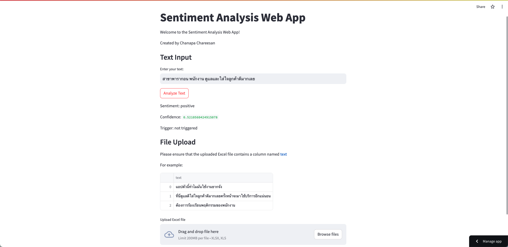

# sentiment-analysis-baseline-model

Welcome to my Sentiment Analysis Web App! This project is a part of my portfolio, showcasing my skills in natural language processing and web development. 

## About the Project

This project aims to analyze sentiment in text data using machine learning techniques. It includes a sentiment classification model trained on a dataset of Thai text, allowing users to input their text data and receive sentiment analysis results.

## Features

- Analyze sentiment in Thai text
- Input text manually or upload an Excel file for batch analysis
- Visualize sentiment analysis results
- Easy-to-use interface

## How to Use

1. Access the web app [here](https://chanapa-sentiment-app.streamlit.app/).
2. Enter your text or upload an Excel file containing text data.
3. Click the "Analyze" button to receive sentiment analysis results.

## Build Process

The sentiment classification model was built using machine learning techniques. You can find the notebook detailing the model building process in the `notebooks` directory.

## Deployment

The web app is deployed using Streamlit and hosted on Heroku. You can access it [here](https://chanapa-sentiment-app.streamlit.app/).

## Feedback

I'm constantly working to improve this project. If you have any feedback, suggestions, or encounter any issues, please feel free to reach out or open an issue.

## Acknowledgments

Special thanks to [Streamlit](https://streamlit.io/) for providing an excellent framework for building web apps with Python.

Happy analyzing!

